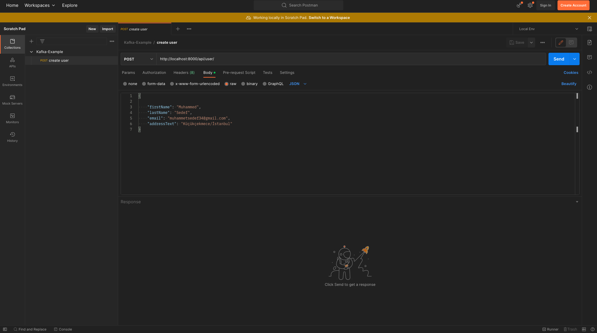

# Kafka-Example
In this project, 
- There are 3 microservices, when a user created via user-service that service insert a record onto user table(postgre) 
and it produce an event to **user_service.user_created.0** topic. 
- Notification-consumer service listen **user_service.user_created.0** topic and simulates the logic of sending 
notification after the event it consumes after notification is sending successfully service insert a record onto couchbase
notification bucket.
- User-address-service also listen user_service.user_created.0 topic and it consume events. According to user's address text
information it insert a record onto user-address table(postgre)

## System Architechure

## Requirements
- [Java 11 JDK](https://www.oracle.com/tr/java/technologies/javase/jdk11-archive-downloads.html)
- [Docker](https://www.docker.com/products/docker-desktop/)
- [Data Grip](https://www.jetbrains.com/datagrip/download/#section=mac) or any other database GUIs
- [Postman](https://www.postman.com/downloads/)

## Setup
- Before run project you need to start docker desktop
- After docker is up, run the docker-compose.yml (You can find it in the infra-setup folder.)
- After the run docker-compose.yml file you will see docker desktop like this: 

- Continue With DB Connection Part

## DB Connection
# Postgre Connection:
    url: jdbc:postgresql://localhost:5432/kafka_example
    username: example
    password: example

* After you successfully connect database, you will see like this in datagrip: 

# Couchbase Connection & Settings
- #### Open http://localhost:8091/ on your browser

      username: Administrator
      password: 123456

- #### Open the buckets tab and click the **ADD BUCKET**

- #### write the bucket name in our example => bucket name is **"notification"**

- #### After that open the query tab on the left side

- #### Run 2 query separately to create index on bucket

      1) CREATE PRIMARY INDEX `idx_default_primary_notification` ON `notification`
      2) CREATE INDEX `id` ON `notification`(`id`)
- #### Open the Security tab on the left side and click the **ADD USER** 

- #### After click the add user you will see a new popup and fill the informations like :
      Username: admin
      Full Name: admin
      Password: 123456
      Verify Password: 123456

# Running
- #### Run each project application file on your code ide.
- #### After you run 3 application successfully you can check postgre db on your GUI you have to see created 2 tables which names ara **user** and **user_address**

- #### Check Topic is created or not http://localhost:9090/ (kafka ui)

- #### If you have come this far without any problems, we can open postman and try a sample request.
- #### You can import postman collection which I share in postman_collection folder

- #### After execute post endpoint and get 200 success message from postman you can see producer and consumer logs on your running terminal also you can check that records are in your databases  

- #### As you can see our records successfully inserted to our databases
- #### To test batch request use MOCK DATA.json file which it is in postman folder, open the postman runner and select that json file and run.

# Topic Partition Settings
- #### To increase topic partition open http://localhost:9090/ (kafka-ui) and open the topic settings.

- #### As you can see I set partition count 4
- #### After set partition count 4, now our consumer's will rebalance because now we have 4 partition so our consumers bind all of partitions

- #### If you want to run one more consumer app follow these steps:

- #### Now you can run one more consumer app, it will up randomly port in your computer's free port because we set server.port as 0 in application.yml

- #### As you can see we have 4 partition and we run 4 consumer app (user-address-service) so each consumer app bind 1 partition of user_service.user_created.0 topic
- #### You can run again batch request on postman and you can easily see your consumer apps consume the event corresponding partition 

